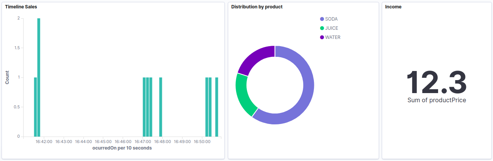

## Preparation

Execute the next commands to create the image and the network

```
docker build . -t vendor-machine-cli -f docker/php/Dockerfile
docker network create vendingmachine
```

## Installation
```
docker run --rm --network vendingmachine -v $(pwd):/app -w /app  vendor-machine-cli composer install
```

## Test
```
docker run --rm --network vendingmachine -v $(pwd):/app -w /app  vendor-machine-cli php bin/phpunit
```

## Execution with main command
```
docker run --rm --network vendingmachine --network vendingmachine -v $(pwd):/app -w /app --interactive --tty vendor-machine-cli php bin/console app:machine-vending-start
```

You can execute all the commands after the prompt `>`

| Command       | Description |
|---------------|---|
| 1             | Add 1 to user credit  |
| 0.5           | Add 0.5 to user credit  |
| 0.25          | Add 0.25 to user credit  |
| 0.1           | Add 0.1 to user credit  |
| RETURN-COIN   | Returns the coins that the user had inserted  |
| GET-WATER     | Make the purchase of the WATER product  |
| GET-JUICE     | Make the purchase of the JUICE product  |
| GET-SODA      | Make the purchase of the SODA product  |
| SERVICE       | Displays a summary of the machine's inventory and allows you to set the amounts of coins and products  |
| EXIT          | Exits the operating console of the machine  |

The commands relative to Coins are based on the parameter `imports` of `services.yaml`

The commands relative to Products are based on the parameter `products` of `services.yaml`

## Execution with individual commands

You can also run the operations individually

```
docker run --rm --network vendingmachine -v $(pwd):/app -w /app --interactive --tty vendor-machine-cli php bin/console app:machine-vending-insert-coin 0.5

docker run --rm --network vendingmachine -v $(pwd):/app -w /app --interactive --tty vendor-machine-cli php bin/console app:machine-vending-return-coin

docker run --rm --network vendingmachine -v $(pwd):/app -w /app --interactive --tty vendor-machine-cli php bin/console app:machine-vending-get-product WATER

docker run --rm --network vendingmachine -v $(pwd):/app -w /app --interactive --tty vendor-machine-cli php bin/console app:machine-vending-service
```

## Status vending machine by http

If you want to check the inventory of the vending machine you can execute:

```
docker run --rm --network host -p 8000:8000 -v $(pwd):/app -w /app  vendor-machine-cli php -S localhost:8000 -t public/
```

And then execute the next URL in your browser:

```
http://localhost:8000/status
```

You will get something like that:

```
{"products":[{"WATER":1},{"JUICE":2},{"SODA":3}],"coins":[{"0.5":4},{"0.1":5},{"0.25":6},{"1":7}],"credit":[[0.5]]}
```

## Data visualization

To use this functionality you need to change the property `dataMiningEnabled` to `true` in `services.yaml`

Next execute the next command:

```
docker-compose -f docker/docker-compose.yml up
```

Enter to:

```
http://localhost:5601/
```

Import `etc/kibana/dashboard_vending_machine.ndjson` to `Management -> Saved Object -> Import`

An example of visualization.


## Improvements

- phpunit -> Check the events created
- phpunit -> Check the messages of the exceptions
- phpunit -> Check elastic
- Protect by token the status endpoint
- Create an API for all the operations in the vending machine
- Create a UI to manage the API
- Add Products and Coins dynamically  
- New repositories (redis, mongo, ...)


